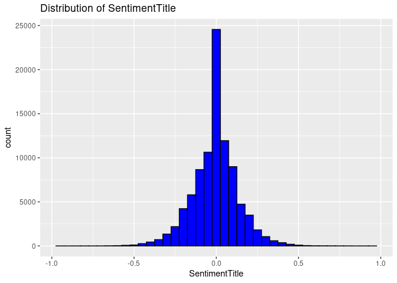
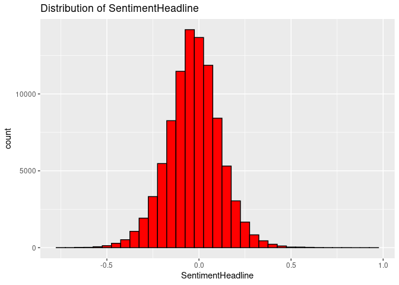
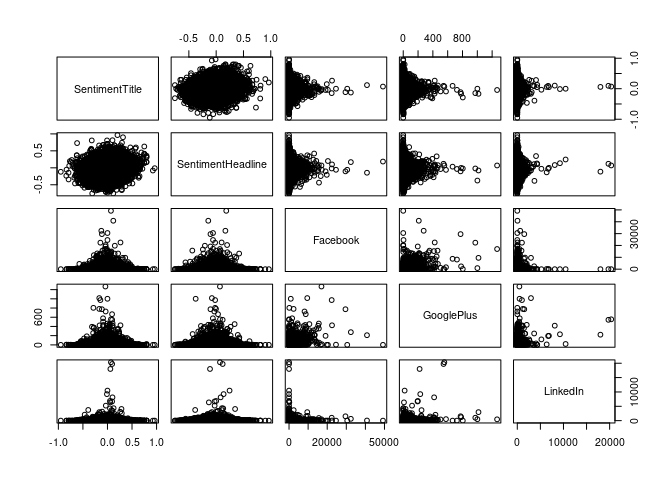

Linear Regression Mini-competition
================

``` r
# Your tasks is to create a linear model that best predicts the sentiment of the sentiment score for a news items’ headline.
```

``` r
library(tidyverse)
library(tidymodels)
library(corrplot)
library(caret)
library(GGally)
```

``` r
news <- read.csv("~/STA 631/Mini Comp/activity04-mini-competition/competition-files/data/news.csv")
```

``` r
# Check for missing values
colSums(is.na(news))
```

    ##            IDLink             Title          Headline            Source 
    ##                 0                 0                 0                 0 
    ##             Topic       PublishDate    SentimentTitle SentimentHeadline 
    ##                 0                 0                 0                 0 
    ##          Facebook        GooglePlus          LinkedIn 
    ##                 0                 0                 0

``` r
# Optionally, create dummy variables for categorical variables such as 'Topic'
news <- news%>% 
  mutate_at(vars(Topic), as.factor) %>%
  mutate(Topic = as.numeric(Topic))

# 1 - Economy
# 2 - Microsoft
# 3 - Obama
# 4 - Palestine
```

``` r
# Compute correlation matrix
cor_matrix <- cor(news %>% select(SentimentTitle, SentimentHeadline, Facebook, GooglePlus, LinkedIn))

# Plot correlation heatmap
corrplot(cor_matrix, method = "circle", type = "upper", order = "hclust", tl.col = "black", tl.srt = 45)
```

<!-- -->

``` r
# Boxplot of SentimentHeadline by Topic
ggplot(news, aes(x = as.factor(Topic), y = SentimentHeadline)) +
  geom_boxplot() +
  labs(title = "Distribution of SentimentHeadline by Topic", x = "Topic", y = "SentimentHeadline")
```

<!-- -->

``` r
# Histogram of SentimentTitle
ggplot(news, aes(x = SentimentTitle)) + 
  geom_histogram(binwidth = 0.05, fill = "blue", color = "black") +
  ggtitle("Distribution of SentimentTitle")
```

<!-- -->

``` r
# Histogram of SentimentHeadline
ggplot(news, aes(x = SentimentHeadline)) + 
  geom_histogram(binwidth = 0.05, fill = "red", color = "black") +
  ggtitle("Distribution of SentimentHeadline")
```

<!-- -->

``` r
# Summary statistics
summary(news)
```

    ##      IDLink          Title             Headline            Source         
    ##  Min.   :     1   Length:92431       Length:92431       Length:92431      
    ##  1st Qu.: 24550   Class :character   Class :character   Class :character  
    ##  Median : 52449   Mode  :character   Mode  :character   Mode  :character  
    ##  Mean   : 51807                                                           
    ##  3rd Qu.: 76784                                                           
    ##  Max.   :104802                                                           
    ##      Topic       PublishDate        SentimentTitle      SentimentHeadline 
    ##  Min.   :1.000   Length:92431       Min.   :-0.950694   Min.   :-0.75543  
    ##  1st Qu.:1.000   Class :character   1st Qu.:-0.079025   1st Qu.:-0.11457  
    ##  Median :2.000   Mode  :character   Median : 0.000000   Median :-0.02606  
    ##  Mean   :2.131                      Mean   :-0.005415   Mean   :-0.02750  
    ##  3rd Qu.:3.000                      3rd Qu.: 0.064385   3rd Qu.: 0.05965  
    ##  Max.   :4.000                      Max.   : 0.962354   Max.   : 0.96465  
    ##     Facebook         GooglePlus          LinkedIn       
    ##  Min.   :   -1.0   Min.   :  -1.000   Min.   :   -1.00  
    ##  1st Qu.:    0.0   1st Qu.:   0.000   1st Qu.:    0.00  
    ##  Median :    5.0   Median :   0.000   Median :    0.00  
    ##  Mean   :  114.1   Mean   :   3.928   Mean   :   16.69  
    ##  3rd Qu.:   34.0   3rd Qu.:   2.000   3rd Qu.:    4.00  
    ##  Max.   :49211.0   Max.   :1267.000   Max.   :20341.00

``` r
# Correlations
correlations <- cor(news %>% select(SentimentTitle, SentimentHeadline, Facebook, GooglePlus, LinkedIn, Topic))
print(correlations)
```

    ##                   SentimentTitle SentimentHeadline      Facebook   GooglePlus
    ## SentimentTitle       1.000000000      0.1839741609 -0.0038104383 -0.010166605
    ## SentimentHeadline    0.183974161      1.0000000000  0.0004726004  0.001751933
    ## Facebook            -0.003810438      0.0004726004  1.0000000000  0.508890223
    ## GooglePlus          -0.010166605      0.0017519331  0.5088902231  1.000000000
    ## LinkedIn             0.003518125      0.0059367648  0.0677558321  0.264525857
    ## Topic                0.003256029      0.0289592082  0.1061164027  0.068454723
    ##                       LinkedIn        Topic
    ## SentimentTitle     0.003518125  0.003256029
    ## SentimentHeadline  0.005936765  0.028959208
    ## Facebook           0.067755832  0.106116403
    ## GooglePlus         0.264525857  0.068454723
    ## LinkedIn           1.000000000 -0.035082953
    ## Topic             -0.035082953  1.000000000

``` r
# Pair plots for relationships
pairs(news %>% select(SentimentTitle, SentimentHeadline, Facebook, GooglePlus, LinkedIn))
```

<!-- -->

``` r
set.seed(123)
training_indices <- createDataPartition(news$SentimentHeadline, p = 0.8, list = FALSE)
train_data <- news[training_indices, ]
test_data <- news[-training_indices, ]
```

``` r
# Multiple linear regression model
model <- lm(SentimentHeadline ~ SentimentTitle + Facebook + GooglePlus + LinkedIn + Topic, data = train_data)
residuals <- resid(model)
fitted_values <- fitted(model)

# Check the summary for model insights
summary(model)
```

    ## 
    ## Call:
    ## lm(formula = SentimentHeadline ~ SentimentTitle + Facebook + 
    ##     GooglePlus + LinkedIn + Topic, data = train_data)
    ## 
    ## Residuals:
    ##      Min       1Q   Median       3Q      Max 
    ## -0.74732 -0.08571  0.00252  0.08664  0.95258 
    ## 
    ## Coefficients:
    ##                  Estimate Std. Error t value Pr(>|t|)    
    ## (Intercept)    -3.452e-02  1.199e-03 -28.781  < 2e-16 ***
    ## SentimentTitle  1.916e-01  3.762e-03  50.918  < 2e-16 ***
    ## Facebook       -7.225e-08  9.380e-07  -0.077   0.9386    
    ## GooglePlus     -7.478e-06  3.355e-05  -0.223   0.8236    
    ## LinkedIn        8.759e-06  3.616e-06   2.422   0.0154 *  
    ## Topic           3.782e-03  5.097e-04   7.420 1.18e-13 ***
    ## ---
    ## Signif. codes:  0 '***' 0.001 '**' 0.01 '*' 0.05 '.' 0.1 ' ' 1
    ## 
    ## Residual standard error: 0.1397 on 73940 degrees of freedom
    ## Multiple R-squared:  0.0347, Adjusted R-squared:  0.03463 
    ## F-statistic: 531.6 on 5 and 73940 DF,  p-value: < 2.2e-16

``` r
ggplot() +
  geom_point(aes(x = fitted_values, y = residuals), alpha = 0.5) +
  geom_hline(yintercept = 0, linetype = "dashed", color = "red") +
  labs(title = "Residuals vs Fitted Values", x = "Fitted Values", y = "Residuals")
```

<!-- -->

``` r
predictions <- predict(model, test_data)
rmse <- sqrt(mean((predictions - test_data$SentimentHeadline)^2))
r_squared <- cor(predictions, test_data$SentimentHeadline)^2

print(paste("RMSE:", rmse))
```

    ## [1] "RMSE: 0.138655609162081"

``` r
print(paste("R²:", r_squared))
```

    ## [1] "R²: 0.0345897086529785"
